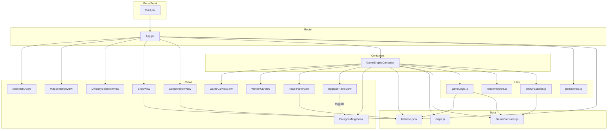

# Architecture: Dependency Graph

**Last Updated:** 2025-12-10  
**Build Tool:** Vite 7.2.7  
**Framework:** React 19

---

## High-Level Architecture



---

## Dependency Details

### Data Layer
**No Dependencies**
- `balance.json` - Pure data
- `maps.js` - Pure data + exports
- `GameConstants.js` - Exports only

### Utils Layer  
**Dependencies:** Data only
- `gameLogic.js` → `balance.json`, `GameConstants.js`
- `renderHelpers.js` → None
- `persistence.js` → None
- `entityFactories.js` → `GameConstants.js`

### Views Layer
**Dependencies:** React, PropTypes, Data
- All Views → React, PropTypes
- `ShopView` → `balance.json`
- `CompendiumView` → `balance.json`
- `TowerPanelView` → `balance.json`
- Others → Props only (pure UI)

### Container Layer
**Dependencies:** Views, Utils, Data, React
- `GameEngineContainer` → All game Views, all Utils, all Data

### Router Layer
**Dependencies:** Containers, Views, Utils, Data
- `App.jsx` → All components, `persistence.js`, `balance.json`

---

## Import Aliases (Vite Config)

```javascript
'@data': 'src/data',
'@views': 'src/views',
'@containers': 'src/containers',
'@utils': 'src/utils',
'@constants': 'src/constants'
```

**Usage:**
```javascript
import BALANCE_DATA from '@data/balance.json';
import GameEngineContainer from '@containers/GameEngineContainer';
```

---

## Critical Paths

**Game Initialization:**
```
main.jsx → App.jsx → GameEngineContainer → 
  (Canvas + HUD + Panel) + (GameLogic + RenderHelpers + EntityFactories)
```

**Data Flow:**
```
balance.json → GameEngineContainer (wave generation, tower stats)
            → Shop (pricing, unlocks)
            → Compendium (display stats)
```

**Entity Creation:**
```
EntityFactories → createTower/createEnemy/createSoldier → GameEngineContainer
```

---

## Build Output

**Chunks:**
- `index-[hash].js` - App code (15.33 KB)
- `react-vendor-[hash].js` - React + ReactDOM (141.06 KB)  
- Total: 156 KB (gzipped: 45.37 KB)

**Code Splitting:** Automatic by Vite
